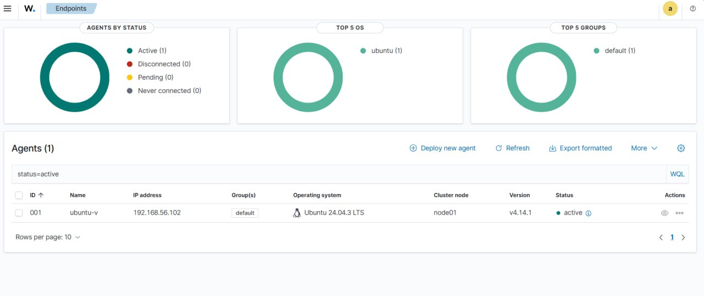

# Wazuh Home Lab – Blue Team Training Environment

Fully functional Wazuh 4.14.1 SIEM laboratory for learning detection & response.

[](https://wazuh.com)
[](https://ubuntu.com)
[](https://kali.org)
[](LICENSE)

## Topology

*(Coming soon)*

## Features
- Wazuh All-in-One deployment
- Ubuntu 24.04 agent (real-time monitoring)
- Detection of port scanning, brute-force, web attacks, FIM, rootkits

## Screenshots



*(more coming soon)*

## Quick Start (VirtualBox)

1. Import `wazuh-4.14.1-all-in-one.ova`
2. Create Ubuntu 24.04 VM (Host-Only + NAT)
3. Install & connect agent:
```bash
curl -so wazuh-agent.deb https://packages.wazuh.com/4.x/apt/pool/main/w/wazuh-agent/wazuh-agent_4.14.1-1_amd64.deb
sudo WAZUH_MANAGER="192.168.56.101" dpkg -i wazuh-agent.deb
sudo systemctl enable --now wazuh-agent
```
4.Attack from Kali → enjoy real-time alerts!
## FUTURE PLANS
Custom Sigma rules for web-attacks
ModSecurity + NGINX WAF
Suricata NIDS integration
Automated PDF reports (Python)
MIT License © 2025–2026 FFFYozakura
